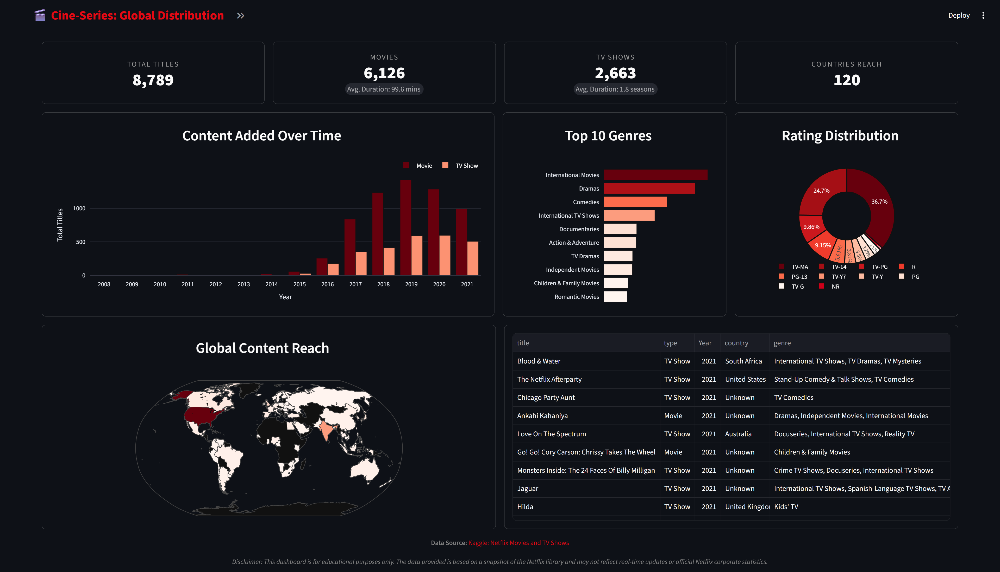
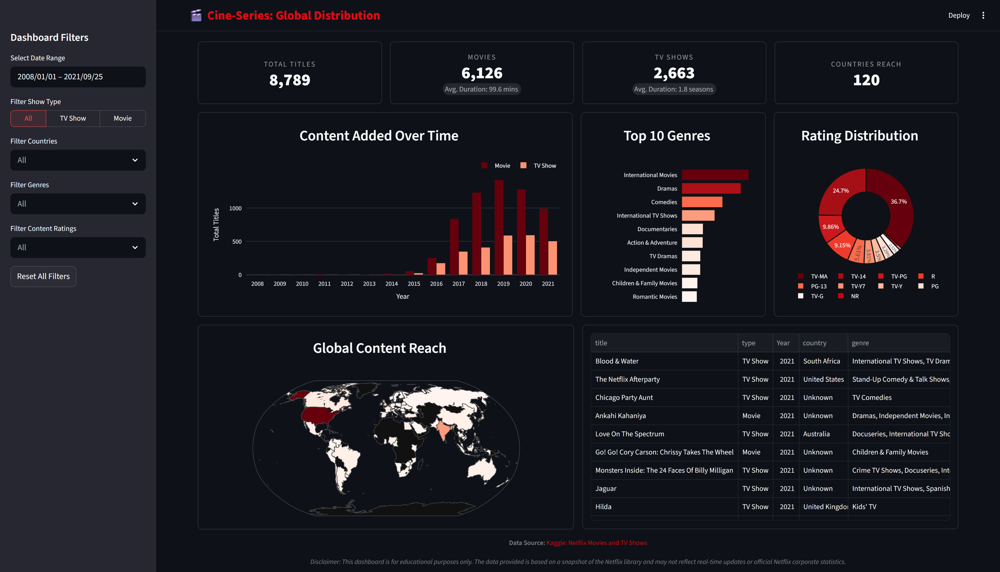

<h1 align="center">
    🎬 cine-series-global-distribution
</h1>

    Streamlit visualization of Netflix Movies & TV Shows

    <picture>
        
        
    </picture>

**Live Demo:** [**cine-series-global-distribution on Streamlit Cloud**](https://cine-series-global-distribution.streamlit.app/)

### **Visual Analytics**

- **Content Added Over Time:** A grouped bar chart comparing the growth of Movies vs. TV Shows across years.
- **Top 10 Genres:** A horizontal bar chart identifying the most popular categories in the current dataset.
- **Rating Distribution:** A donut chart showing the maturity rating spread (e.g., TV-MA, PG-13), helping visualize target audience demographics.
- **Global Content Reach:** A map illustrating content density by country.
- **Data Exploration:** A formatted dataframe table display that includes title, type, year, country, genre, rating, and duration for quick exploration.

### Interactive Filters

- **Date Filter:** A range selector to filter content based on the specific date it was added to the Netflix library.
- **Show Type Filter:** A segmented control to toggle between "Movies," "TV Shows," or a combined "All" view.
- **Countries Filter:** A multi-selector dropdown that handles filtering of countries.
- **Genres Filter:** A multi-selector dropdown that handles filtering of genres.
- **Content Rating Filter:** A multi-selector dropdown that handles filtering of content rating.
- **Reset Filters:** A one-click button that restore all filters to their default values.

### About this Dataset:

Netflix is one of the most popular media and video streaming platforms. They have over 8000 movies or tv shows available on their platform, as of mid-2021, they have over 200M Subscribers globally. This tabular dataset consists of listings of all the movies and tv shows available on Netflix, along with details such as - cast, directors, ratings, release year, duration, etc.

**Data Source:** [Kaggle: Netflix Movies and TV Shows by _Shivam Bansal_](https://www.kaggle.com/datasets/shivamb/netflix-shows)
